# Mini-Hackatón · Reporte Técnico
## Clasificación de Calidad de Vinos — Evaluación y Validación de Modelos de Clasificación

**Equipo:**
- Carlos Alberto Damm Manzanera
- Agustín Gerardo Jardínez Arciniega

**Materia:** Gestión de Proyectos de Inteligencia Artificial
**Dataset:** Wine Quality Dataset — UCI Machine Learning Repository (vino tinto + vino blanco)

> **Nota sobre el tema elegido:** la actividad permitía aplicar el flujo de evaluación y
> validación a cualquier problema de clasificación, no exclusivamente al caso clínico de
> diabetes. Nuestro equipo eligió el problema de **control de calidad de vinos**, que conserva
> la misma naturaleza metodológica (clasificación binaria con clases desbalanceadas, costos
> asimétricos de error y necesidad de ajuste de umbral). Por ello, en este reporte el concepto
> de *"impacto en salud"* se traslada a su análogo directo: el **impacto en el control de
> calidad y la decisión de negocio** dentro de la industria alimentaria.

---

## Tabla de contenido

1. [Definición del problema y contexto](#1-definición-del-problema-y-contexto)
2. [Exploración del dataset](#2-exploración-del-dataset)
3. [Modelos y entrenamiento](#3-modelos-y-entrenamiento)
4. [Matriz de confusión e interpretación](#4-matriz-de-confusión-e-interpretación)
5. [Cálculo e interpretación de métricas](#5-cálculo-e-interpretación-de-métricas)
6. [Comparación con el baseline](#6-comparación-con-el-baseline)
7. [Validación cruzada](#7-validación-cruzada)
8. [Curva ROC y AUC](#8-curva-roc-y-auc)
9. [Ajuste de umbral y análisis de trade-offs](#9-ajuste-de-umbral-y-análisis-de-trade-offs)
10. [Pruebas A/B simuladas](#10-pruebas-ab-simuladas)
11. [Justificación técnica e impacto](#11-justificación-técnica-e-impacto)
12. [Conclusiones y recomendaciones](#12-conclusiones-y-recomendaciones)
13. [Contribuciones del equipo y dinámica de trabajo](#13-contribuciones-del-equipo-y-dinámica-de-trabajo)
14. [Estructura del repositorio y reproducción](#14-estructura-del-repositorio-y-reproducción)

---

## 1. Definición del problema y contexto

**¿Qué se quiere predecir?**
A partir de las características fisicoquímicas de un vino (acidez, azúcar residual, alcohol,
sulfatos, pH, etc.), predecir si el vino puede clasificarse como de **alta calidad**.

**Formulación como clasificación binaria.**
El dataset original puntúa la calidad con un valor numérico (`quality`, de 0 a 10). Para este
proyecto el problema se transforma en una clasificación binaria:

| Clase | Definición | Significado |
|------|------------|-------------|
| `0` | `quality < 7` | Calidad estándar |
| `1` | `quality >= 7` | Alta calidad |

**¿Por qué es importante?**
En la industria alimentaria, clasificar correctamente la calidad de un lote apoya decisiones de
*pricing*, etiquetado premium y control de producción. Es un problema de **control de calidad**:
queremos un sistema que ayude a decidir, de forma objetiva y reproducible, si un lote puede
considerarse de alta calidad a partir de mediciones de laboratorio.

**Costos de los errores (asimétricos).**

| Error | Qué significa | Costo asociado |
|-------|---------------|----------------|
| **Falso Negativo (FN)** | Un vino de alta calidad se clasifica como estándar | Pérdida de oportunidad: se subvalora producto premium y se deja dinero sobre la mesa |
| **Falso Positivo (FP)** | Un vino estándar se clasifica como alta calidad | Riesgo reputacional: se vende como premium algo que no lo es, afectando la confianza del cliente |

Esta asimetría es la razón por la que **no basta con la *accuracy***: necesitamos analizar
recall, especificidad y el ajuste de umbral según qué error sea más costoso para el negocio.

**Impacto.**
Un clasificador confiable estandariza un criterio que normalmente depende de catadores
expertos, reduce subjetividad, acelera la inspección y permite priorizar revisiones manuales
solo en los lotes dudosos.

---

## 2. Exploración del dataset

- **Fuente:** Wine Quality Dataset (UCI), combinando las bases de **vino tinto** y **vino
  blanco**. Se agrega la variable `wine_type` para distinguir el origen.
- **Variable objetivo:** `high_quality`, derivada de `quality`. La columna `quality` original se
  **elimina antes de entrenar** para evitar *fuga de información* (data leakage), ya que la
  etiqueta se construye directamente de ella.
- **Desbalance de clases:** la clase de alta calidad es minoritaria (**≈ 20 %** de los
  registros). Este desbalance condiciona toda la evaluación: obliga a usar métricas robustas
  (F1, recall, especificidad, ROC-AUC) en lugar de la *accuracy* y a estratificar las
  particiones.

| Distribución de `quality` | Distribución de clases binarias |
|---|---|
| 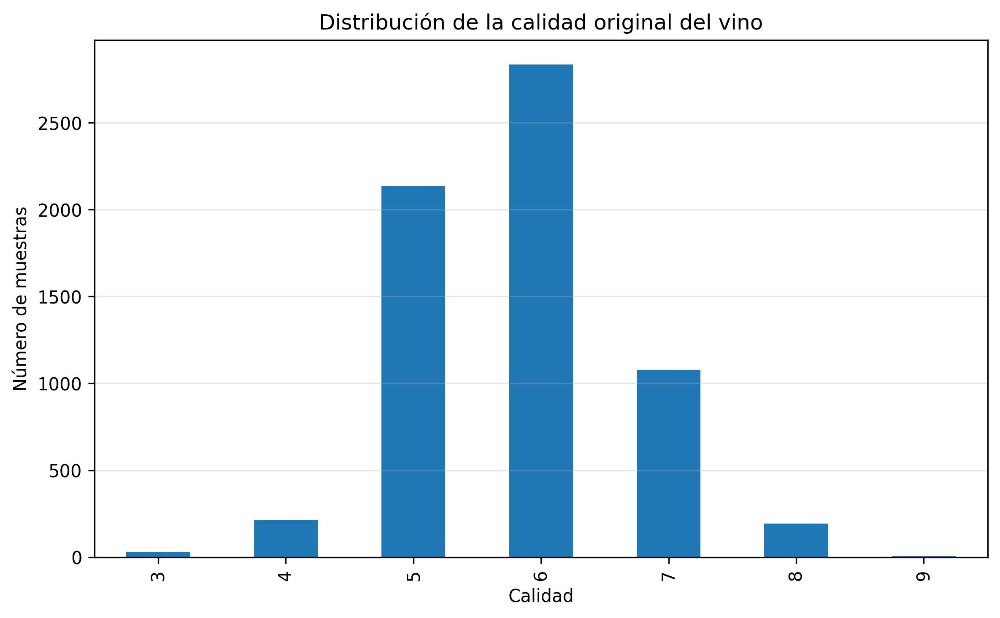 | 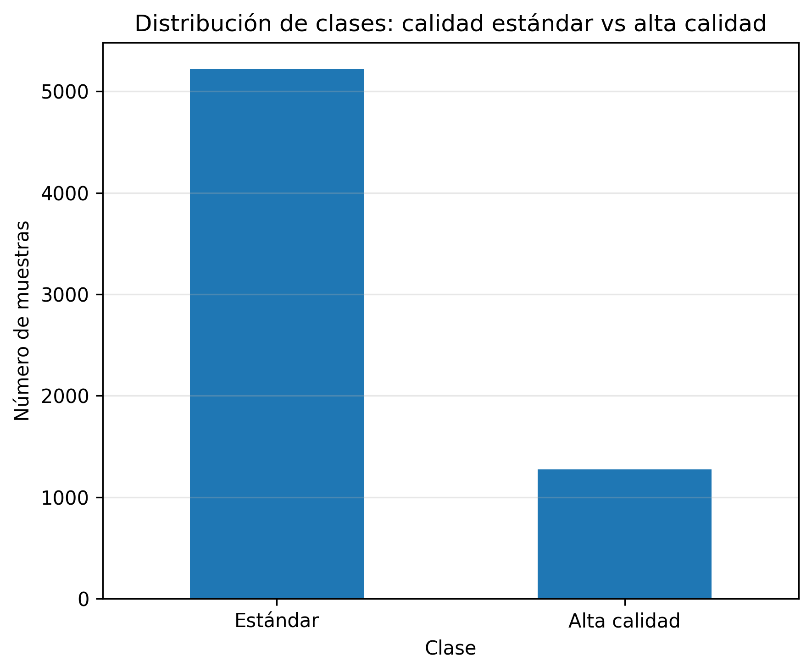 |

---

## 3. Modelos y entrenamiento

Se entrenaron tres modelos clásicos, con división **Train/Test estratificada**:

1. **Regresión Logística** — *baseline* solicitado por la actividad. Usa estandarización
   (`StandardScaler`) dentro de un `Pipeline`, por ser sensible a la escala de las variables.
2. **Árbol de Decisión** — modelo interpretable de comparación. No requiere escalamiento.
3. **Random Forest** — modelo candidato principal. No requiere escalamiento.

> Decisión técnica documentada: los modelos basados en árboles no necesitan estandarización,
> mientras que la Regresión Logística sí; por eso solo el *baseline* incorpora el escalador en
> su *pipeline*.

---

## 4. Matriz de confusión e interpretación

La matriz de confusión permite interpretar el **tipo** de error, no solo cuántos. Para el
conjunto de prueba (≈ 1,300 vinos):

- **TN** — vinos estándar clasificados correctamente como estándar.
- **FP** — vinos estándar clasificados *incorrectamente* como alta calidad.
- **FN** — vinos de alta calidad clasificados *incorrectamente* como estándar.
- **TP** — vinos de alta calidad clasificados correctamente.

Matriz de confusión del mejor modelo inicial (Random Forest), umbral 0.50:

| | Predicho: Estándar | Predicho: Alta calidad |
|---|---|---|
| **Real: Estándar** | TN = 995 | FP = 49 |
| **Real: Alta calidad** | FN = 104 | TP = 152 |

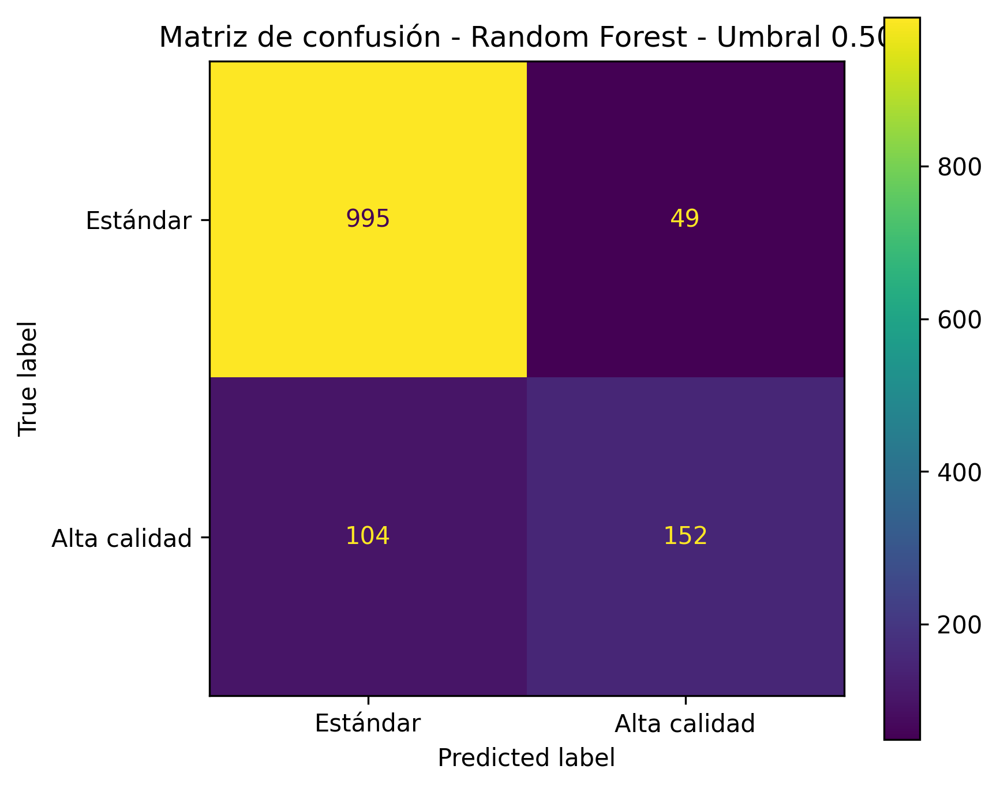

**Lectura:** el modelo es muy bueno evitando falsas alarmas (solo 49 FP → alta especificidad),
pero deja escapar 104 vinos de alta calidad (FN), lo que limita el recall. Este patrón es el que
buscaremos corregir con el ajuste de umbral (sección 9).

---

## 5. Cálculo e interpretación de métricas

Métricas de los tres modelos en el conjunto de prueba, con **umbral estándar de 0.50**:

| Modelo | Accuracy | Precision | Recall | Especificidad | F1-score | ROC-AUC |
|--------|:---:|:---:|:---:|:---:|:---:|:---:|
| Regresión Logística (baseline) | 0.8223 | 0.6147 | 0.2617 | 0.9598 | 0.3671 | 0.8048 |
| Árbol de Decisión | 0.7169 | 0.3935 | 0.8086 | 0.6944 | 0.5294 | 0.8168 |
| **Random Forest** | **0.8823** | **0.7562** | 0.5938 | 0.9531 | **0.6652** | **0.9080** |

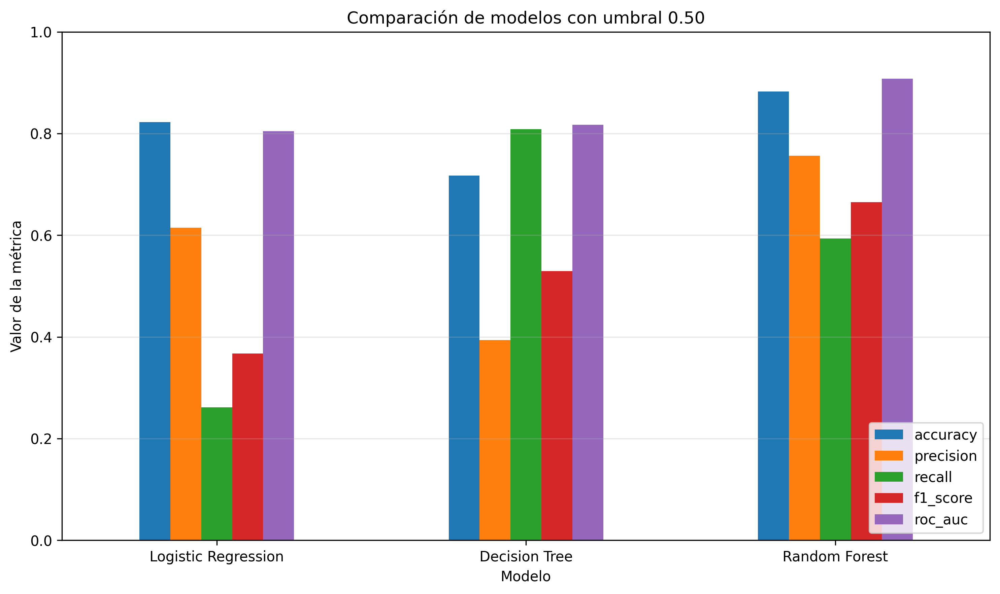

**Interpretación de cada métrica:**
- **Accuracy:** proporción total de aciertos. Engañosa con clases desbalanceadas (un modelo que
  dijera "todo es estándar" rondaría el 80 %).
- **Precision:** de los vinos que el modelo declara "alta calidad", cuántos lo son realmente.
  Penaliza los FP.
- **Recall (sensibilidad):** de los vinos realmente de alta calidad, cuántos detecta. Penaliza
  los FN.
- **Especificidad:** de los vinos realmente estándar, cuántos identifica como tales.
- **F1-score:** media armónica de precision y recall; métrica de referencia ante desbalance.
- **ROC-AUC:** capacidad de separación de clases independiente del umbral.

**Lectura comparada:** el Árbol de Decisión logra el recall más alto (0.81) pero a costa de una
precisión muy baja (0.39) y muchos FP. La Regresión Logística es muy específica pero casi no
detecta vinos de alta calidad (recall 0.26). El **Random Forest ofrece el mejor balance global**
(mayor F1 y ROC-AUC).

---

## 6. Comparación con el baseline

El *baseline* es la **Regresión Logística**. La comparación demuestra la mejora aportada por el
modelo candidato:

| Métrica | Baseline (Reg. Logística) | Random Forest | Mejora |
|---------|:---:|:---:|:---:|
| F1-score | 0.3671 | 0.6652 | **+0.298** |
| Recall | 0.2617 | 0.5938 | **+0.332** |
| ROC-AUC | 0.8048 | 0.9080 | **+0.103** |
| Precision | 0.6147 | 0.7562 | +0.142 |

El baseline, aunque muy específico, es inservible en la práctica porque detecta menos de un
tercio de los vinos de alta calidad. El Random Forest **más que duplica el recall y el F1**
manteniendo alta precisión, por lo que se adopta como modelo principal.

---

## 7. Validación cruzada

Para verificar que el desempeño es **estable** y no depende de una partición afortunada, se
aplicó **Stratified K-Fold** (que conserva la proporción de clases en cada *fold*). Resultados
(media ± desviación estándar):

| Modelo | Accuracy | Precision | Recall | F1 | ROC-AUC |
|--------|:---:|:---:|:---:|:---:|:---:|
| Regresión Logística | 0.817 ± 0.010 | 0.574 ± 0.052 | 0.267 ± 0.021 | 0.364 ± 0.028 | 0.810 ± 0.014 |
| Árbol de Decisión | 0.719 ± 0.032 | 0.400 ± 0.024 | 0.823 ± 0.055 | 0.536 ± 0.016 | 0.818 ± 0.011 |
| **Random Forest** | **0.888 ± 0.010** | **0.767 ± 0.036** | 0.619 ± 0.034 | **0.684 ± 0.028** | **0.920 ± 0.013** |

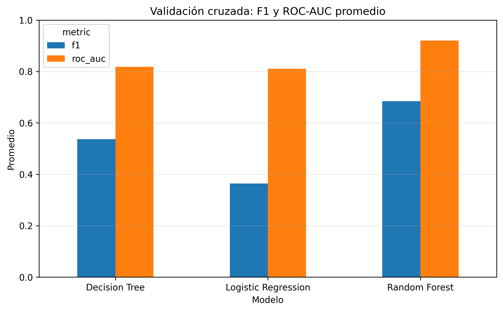

**Interpretación:** las desviaciones estándar son pequeñas (≈ 0.01–0.03), lo que indica un
desempeño **consistente entre particiones**. El Random Forest mantiene su ventaja en F1 y
ROC-AUC en validación cruzada, confirmando que no se trata de sobreajuste a un único *split*.

---

## 8. Curva ROC y AUC

La curva ROC muestra la relación entre la tasa de verdaderos positivos (recall) y la tasa de
falsos positivos al variar el umbral. El **AUC** resume, en un solo número, la capacidad de
separación de clases (1.0 = perfecto, 0.5 = azar).

| Modelo | ROC-AUC |
|--------|:---:|
| Regresión Logística | 0.8048 |
| Árbol de Decisión | 0.8168 |
| **Random Forest** | **0.9080** |

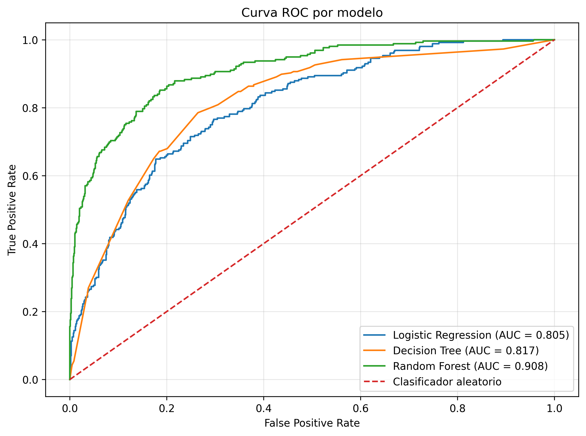

El Random Forest domina la curva ROC con AUC = 0.908, lo que significa que, ante un par
aleatorio (un vino de alta calidad y uno estándar), el modelo asigna mayor probabilidad al de
alta calidad el 90.8 % de las veces.

---

## 9. Ajuste de umbral y análisis de trade-offs

El umbral por defecto de 0.50 es solo un punto de partida. Como el Random Forest a 0.50 deja
muchos FN (recall 0.59), se buscó el **umbral que maximiza el F1-score** sobre el modelo final,
analizando la curva precision–recall.

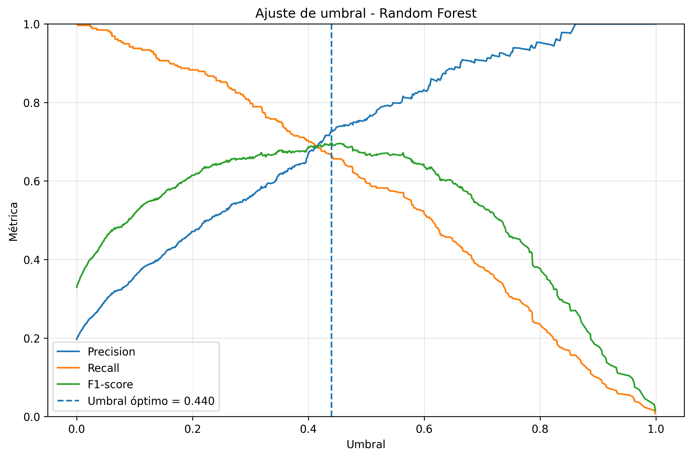

**Umbral óptimo encontrado: 0.4399** (máximo F1).

| Umbral | Precision | Recall | Especificidad | F1-score |
|:---:|:---:|:---:|:---:|:---:|
| 0.50 (estándar) | 0.7562 | 0.5938 | 0.9531 | 0.6652 |
| **0.4399 (óptimo)** | 0.7277 | **0.6680** | 0.9387 | **0.6965** |

Efecto del cambio de umbral sobre la matriz de confusión:

| Umbral 0.50 | Umbral optimizado 0.4399 |
|---|---|
|  | 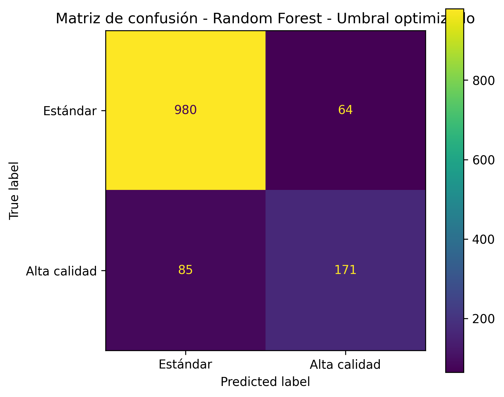 |

**Análisis de trade-offs:** bajar el umbral hace al modelo más "permisivo" para declarar alta
calidad. El efecto es claro y esperado:
- **Sube el recall** (0.594 → 0.668): se recuperan vinos de alta calidad que antes se perdían
  (menos FN).
- **Baja levemente la precisión y la especificidad** (más FP): el costo de capturar más
  positivos.
- **El F1 mejora** (0.665 → 0.697), porque la ganancia en recall supera la pérdida en precisión.

El umbral se elige según el objetivo del negocio: si lo más costoso es perder producto premium
(FN), conviene este umbral más bajo; si lo más costoso es vender estándar como premium (FP),
convendría mantener o subir el umbral.

---

## 10. Pruebas A/B simuladas

Se simuló una prueba A/B comparando dos estrategias de decisión con el **mismo modelo** (Random
Forest), cambiando solo el umbral:

- **Grupo A:** umbral estándar 0.50.
- **Grupo B:** umbral optimizado 0.4399.

| Grupo | Umbral | TN | FP | FN | TP | Recall | Especificidad | F1 |
|-------|:---:|:---:|:---:|:---:|:---:|:---:|:---:|:---:|
| A | 0.50 | 995 | 49 | 104 | 152 | 0.5938 | 0.9531 | 0.6652 |
| **B** | 0.4399 | 980 | 64 | 85 | 171 | **0.6680** | 0.9387 | **0.6965** |

| FP vs FN | Recall vs Especificidad |
|---|---|
| 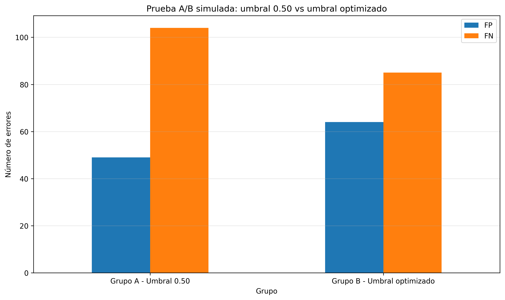 | 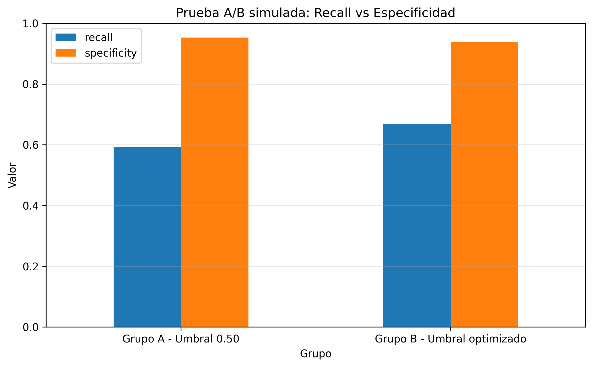 |

**Resultado del experimento:** al pasar del Grupo A al Grupo B, los **falsos negativos bajan de
104 a 85** (−19 vinos de alta calidad recuperados) a cambio de **15 falsos positivos
adicionales** (49 → 64). El recall sube ~7.4 puntos y la especificidad cae solo ~1.4 puntos. La
estrategia B (umbral optimizado) ofrece un mejor balance para el objetivo de detectar más vinos
de alta calidad.

---

## 11. Justificación técnica e impacto

**Selección del modelo final: Random Forest con umbral 0.4399.**

Se eligió considerando:
- **Mejor F1-score** (0.697 con umbral óptimo) y **mejor ROC-AUC** (0.908).
- **Estabilidad** confirmada en validación cruzada (desviaciones pequeñas).
- **Mejor balance FP/FN** tras el ajuste de umbral, frente al exceso de FP del Árbol de Decisión
  y el exceso de FN de la Regresión Logística.

| Métrica del modelo final | Valor |
|---|---|
| Modelo | Random Forest |
| Umbral por defecto | 0.50 |
| Umbral optimizado | 0.4399 |
| F1 (defecto → optimizado) | 0.6652 → 0.6965 |
| Recall (defecto → optimizado) | 0.5938 → 0.6680 |
| Especificidad (defecto → optimizado) | 0.9531 → 0.9387 |
| ROC-AUC | 0.9080 |

**Relación con el impacto (analogía con el caso clínico).**
En el problema clínico original, un FN (no detectar a un paciente enfermo) es el error más
costoso, por lo que se prioriza el recall. En nuestro problema de control de calidad, el FN
equivale a **subvalorar producto premium**: el ajuste de umbral hacia abajo prioriza
precisamente la reducción de FN, igual que se haría en un contexto de tamizaje de salud. La
metodología (matriz de confusión → métricas → umbral → A/B) es idéntica; solo cambia la
interpretación del costo de cada error.

> **Transparencia sobre el objetivo SMART.** El objetivo de referencia de la actividad
> (recall ≥ 80 % y especificidad ≥ 70 %) estaba planteado para el caso clínico de diabetes.
> Nuestro modelo final alcanza **especificidad 93.9 %** (muy por encima del 70 %) y
> **recall 66.8 %**. El recall queda por debajo del 80 %: alcanzarlo requeriría bajar más el
> umbral (sacrificando precisión) o incorporar técnicas adicionales de manejo de desbalance
> (p. ej. `class_weight` o sobremuestreo), lo cual queda señalado como trabajo futuro.

---

## 12. Conclusiones y recomendaciones

1. **El Random Forest es el mejor modelo** para este problema: supera ampliamente al baseline en
   F1 (+0.30), recall (+0.33) y ROC-AUC (+0.10), y es estable en validación cruzada.
2. **La accuracy no es suficiente** ante el desbalance (~20 % de clase positiva): las decisiones
   se tomaron con F1, recall, especificidad y ROC-AUC.
3. **El ajuste de umbral aporta valor real**: pasar de 0.50 a 0.4399 mejora el F1 y reduce los
   FN, como confirmó la prueba A/B (104 → 85 FN).
4. **El umbral debe fijarse según el costo del negocio**: priorizar recall si lo caro es perder
   producto premium; priorizar precisión/especificidad si lo caro es vender estándar como
   premium.

**Recomendaciones / trabajo futuro:**
- Probar técnicas de manejo de desbalance (`class_weight='balanced'`, SMOTE) para elevar el
  recall hacia el 80 % sin perder demasiada precisión.
- Evaluar modelos adicionales (p. ej. Gradient Boosting / XGBoost).
- Ingeniería de variables e interpretabilidad (importancia de características) para entender qué
  propiedades fisicoquímicas determinan la alta calidad.

**Dashboard de resultados:**

| Resumen del dashboard | Métricas clave del modelo final |
|---|---|
| 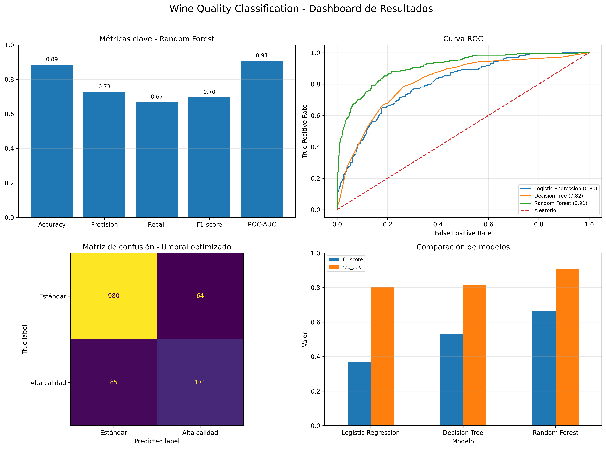 | 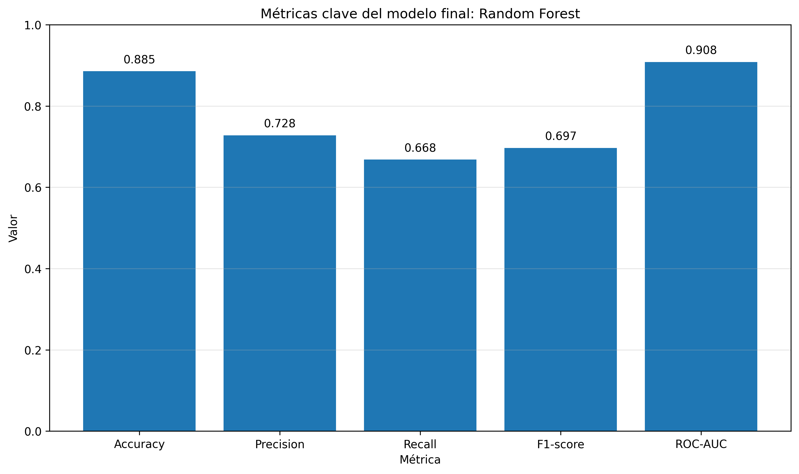 |

---

## 13. Contribuciones del equipo y dinámica de trabajo

El proyecto se desarrolló bajo la dinámica de **pair programming**, alternando los roles de
*driver* (escribe el código) y *navigator* (revisa, sugiere y detecta errores) cada 20–30
minutos. Ambos integrantes participaron activamente en la codificación y en las decisiones
técnicas, las cuales quedaron documentadas en el notebook. El historial de Git refleja commits
de ambos integrantes.

| Integrante | Participación |
|------------|---------------|
| Carlos Alberto Damm Manzanera | Codificación, decisiones técnicas y documentación (driver/navigator alternado) |
| Agustín Gerardo Jardínez Arciniega | Codificación, decisiones técnicas y documentación (driver/navigator alternado) |

> **Uso de IA generativa:** se utilizó como apoyo para explicaciones, generación/depuración de
> código, ideas de visualización y redacción de este reporte, conforme a las reglas de la
> actividad. El análisis, las decisiones y la validación fueron realizados por el equipo.

---

## 14. Estructura del repositorio y reproducción

```
Hackaton/
├── notebooks/
│   └── Clasificacion_de_calidad_de_vinos.ipynb   # Notebook de experimentación
├── Resultados/                                    # Métricas exportadas (CSV)
│   ├── model_metrics_threshold_050.csv            # Métricas de los 3 modelos a umbral 0.50
│   ├── cross_validation_results.csv               # Resultados de validación cruzada
│   ├── roc_auc_results.csv                         # ROC-AUC por modelo
│   ├── threshold_analysis.csv                      # Barrido de umbrales (precision/recall/F1)
│   ├── ab_testing_results.csv                      # Resultados de la prueba A/B
│   └── final_model_summary.csv                     # Resumen del modelo final
├── Imagenes/                                       # Gráficas del análisis
├── Dashboard/                                       # Tablero visual de resultados
└── README.md                                        # Este reporte técnico
```

**Tecnologías:** Python · pandas · numpy · scikit-learn · matplotlib.

**Reproducción local:**

```bash
pip install pandas numpy matplotlib scikit-learn
jupyter notebook notebooks/Clasificacion_de_calidad_de_vinos.ipynb
```

El notebook ejecuta el flujo completo: carga y exploración del dataset, entrenamiento de los tres
modelos, cálculo de métricas, validación cruzada, curva ROC, ajuste de umbral, pruebas A/B y
generación del dashboard.
